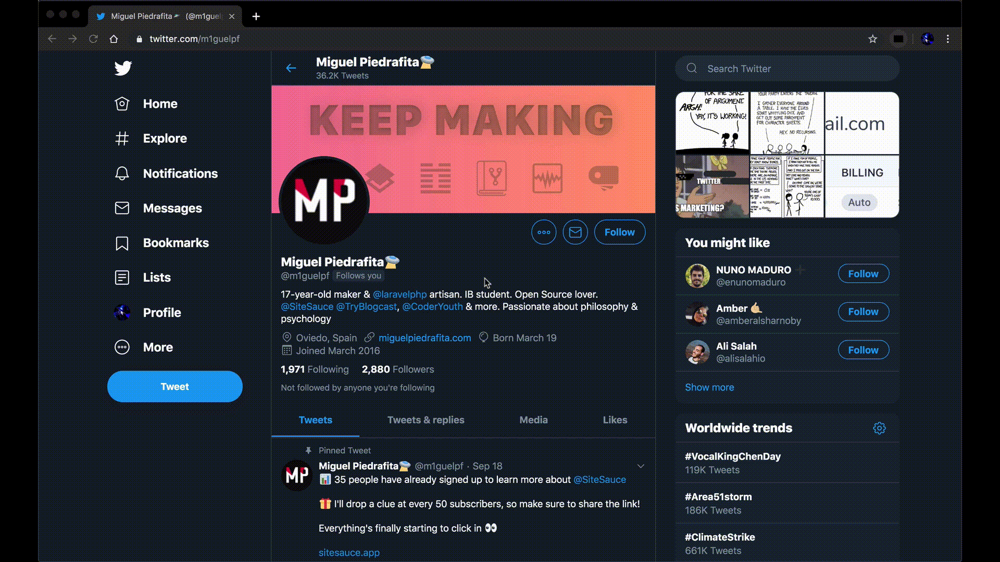
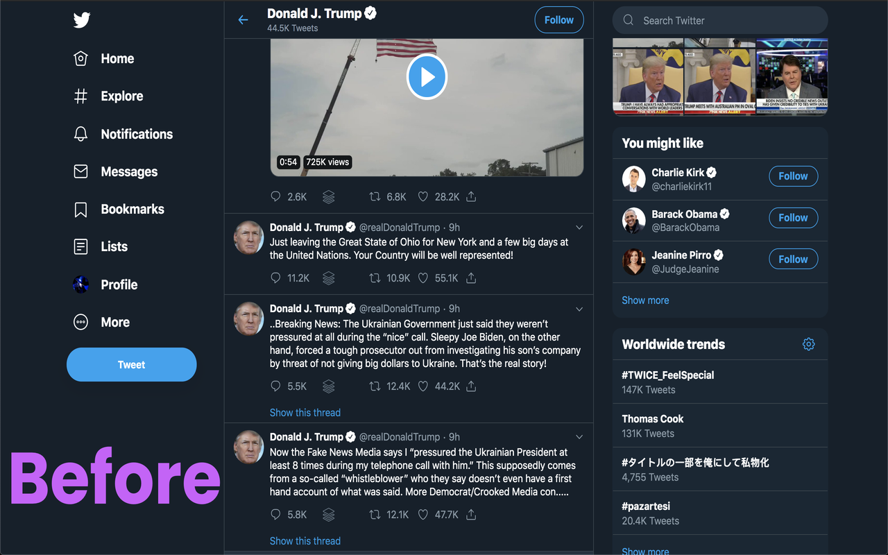
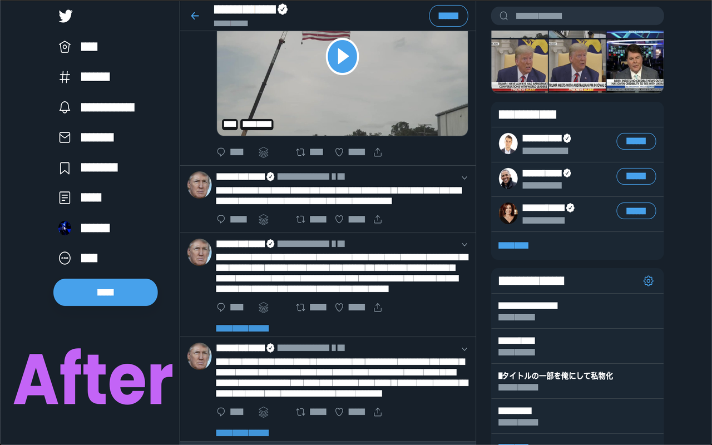

# redact-the-web

> Redacts text on the web. Works on both Chrome & Firefox 😜



## Installation

Install the [Chrome extension manually](https://superuser.com/a/247654) from `release/chrome` folder or install the [Firefox extension manually](https://developer.mozilla.org/en-US/docs/Mozilla/Add-ons/WebExtensions/Temporary_Installation_in_Firefox) from `release/firefox` folder.

## Development

Install all the dependencies using `yarn`.

Write your code in `background.js` & `content.js`.

To transpile it, run `yarn prod` in the terminal. This will generate `release/` folder.

`release/` folder contains `chrome/`, `firefox/` & `zip/` folder.

`chrome/` folder contains transpiled code that can be run in Google Chrome.

`firefox/` folder contains transpiled code that can be run in Mozilla Firefox.

`zip/` folder contains `.zip` files of both Chrome & Firefox.

## Generate Extension Icons

Download & Install [Image Magick](https://www.imagemagick.org/).

Go to `icons` folder & put an `icon128.png` in the folder.

Then run `./generate_icons.sh` to generate rest of the icons.

## npm scripts

```json
"scripts": {
	"clean": "rimraf release/chrome release/firefox release/zip",
	"clean:redundant": "rimraf release/**/generate_icons.sh release/**/*.js.map",
	"clean:zip": "rimraf release/chrome/*.zip release/firefox/*.zip",
	"build:parcel:firefox": "parcel build background.js content.js --out-dir release/firefox",
	"build:parcel:chrome": "parcel build background.js content.js --out-dir release/chrome",
	"copy:firefox": "cpy 'manifest.firefox.json' 'style.firefox.css' 'icons' 'release/firefox'",
	"copy:chrome": "cpy 'manifest.chrome.json' 'style.chrome.css' 'icons' 'release/chrome'",
	"rename:firefox": "rename 'release/firefox/manifest.firefox.json' 'release/firefox/manifest.json' && rename 'release/firefox/style.firefox.css' 'release/firefox/style.css'",
	"rename:chrome": "rename 'release/chrome/manifest.chrome.json' 'release/chrome/manifest.json' && rename 'release/chrome/style.chrome.css' 'release/chrome/style.css'",
	"zip:firefox": "web-ext build --source-dir release/firefox --artifacts-dir release/firefox",
	"zip:chrome": "web-ext build --source-dir release/chrome --artifacts-dir release/chrome",
	"rename:zip:firefox": "rename release/firefox/*.zip 'release/firefox/{{f}}-firefox'",
	"rename:zip:chrome": "rename release/chrome/*.zip 'release/chrome/{{f}}-chrome'",
	"copy:zip:firefox": "cpy 'release/firefox/*.zip' 'release/zip/'",
	"copy:zip:chrome": "cpy 'release/chrome/*.zip' 'release/zip/'",
	"magick": "cd screenshots && magick mogrify -resize 1280x800! *.png",
	"prod": "npm-run-all clean build:parcel:* copy:* rename:* clean:redundant zip:* rename:zip:* copy:zip:* clean:zip",
	"package:chrome": "'/Applications/Google Chrome.app/Contents/MacOS/Google Chrome' --pack-extension=./release/chrome --pack-extension-key=./release/chrome.pem",
	"package:firefox": "web-ext sign --api-key=$API_KEY --api-secret=$API_SECRET --source-dir release/firefox --artifacts-dir release/"
}
```

## Description

# clean

> Remove the `release/chrome`, `release/firefox` & `release/zip` folder.

# clean:redundant

> Remove `generate_icons.sh` & `*.js.map` from the `release/chrome` & `release/firefox` folder.

# clean:zip

> Remove `zip` files from the `release/chrome` & `release/firefox` folder.

# build:parcel:firefox

> Build `backround.js` & `content.js` into the `release/firefox` folder.

# build:parcel:chrome

> Build `backround.js` & `content.js` into the `release/chrome` folder.

# copy:firefox

> Copy `manifest.firefox.json`, `style.firefox.css` & `icons` folder into the `release/firefox` folder.

# copy:chrome

> Copy `manifest.chrome.json`, `style.chrome.css` & `icons` folder into the `release/chrome` folder.

# rename:firefox

> Rename `manifest.firefox.json` to `manifest.json` in `release/firefox` folder.

# rename:chrome

> Rename `manifest.chrome.json` to `manifest.json` in `release/chrome` folder.

# zip:firefox

> Zip all files from `release/firefox` folder.

# zip:chrome

> Zips all files from `release/chrome` folder.

# rename:zip:firefox

> Rename `zip` file in `release/firefox` folder by appending `-firefox` to it.

# rename:zip:chrome

> Rename `zip` file in `release/chrome` folder by appending `-chrome` to it.

# copy:zip:firefox

> Copy `zip` file from `release/firefox` folder to `release/zip` folder.

# copy:zip:chrome

> Copy `zip` file from `release/chrome` folder to `release/zip` folder.

# magick

> Uses ImageMagick to make all images of 1280x800 resolution in `screenshots/` folder.

# prod

> Runs `clean`, `build:parcel:*`, `copy:*`, `rename:*`, `clean:redundant`, `zip:*`, `rename:zip:*`, `copy:zip:*` & `clean:zip:*` script in order.

# package:chrome

> Packages extension into `.crx` file for Chrome Extensions. First, generate `chrome.pem` private key manually through https://www.adambarth.com/experimental/crx/docs/packaging.html

# package:firefox

> Packages extension into `.xpi` file for Mozilla Add-on. First, upload it to https://addons.mozilla.org/ with source-code to get it approved. For more info, see https://stackoverflow.com/a/41713280/6141587

Note: To run this command you need to do the following in the terminal:

```bash
$ API_KEY=<your-api-key> API_SECRET=<your-api-secret> yarn package:firefox
```

If you are using Windows, then replace `$API_KEY` by `%API_KEY%` in `package.json` to make sure it works.

## Screenshots

### You really gonna read this 💩shit?



### Well not anymore 😂



## Credits

Thanks to [Miguel Piedrafita🛸](https://twitter.com/m1guelpf) for his [super cool implementation](https://twitter.com/deadcoder0904/status/1175015704631734272) on [Site Sauce](https://sitesauce.app/)